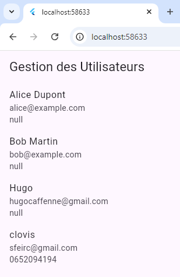
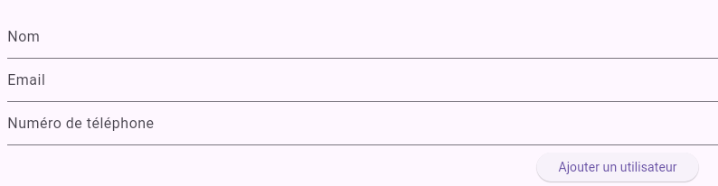

### Rapport : Application Flutter avec connexion a une Base de Données MySQL distante

#### **Objectifs du TP**
1. Configurer un backend avec Node.js pour interagir avec une base de données MySQL situé sur une machine "distante" (VM).
2. Développer une application Flutter intégrée à ce backend via une API REST.
3. Afficher et ajouter des données (utilisateurs) dans l'application flutter.

---

#### **Étapes Réalisées**

##### **1. Backend avec Node.js et MySQL**
- **Création de l’API REST** :
  - Endpoint GET : Récupère la liste des utilisateurs avec leurs informations (nom, email, téléphone).
  - Endpoint POST : Permet d’ajouter un utilisateur (nom, email, téléphone).

  **Code du backend :**

### **Fichier `server.js`**

#### **1. Importation des modules nécessaires**
```javascript
const express = require('express');
const mysql = require('mysql');
const app = express();
const cors = require('cors');  // Importation du package CORS
const port = 3000; // Port d'écoute du serveur
```
- **`express`** : Framework Node.js pour créer des applications web et des API.
- **`mysql`** : Module pour se connecter à une base de données MySQL.
- **`cors`** : permet les requêtes HTTP cross-origin (utilisé pour éviter les erreurs CORS lorsqu'on communique entre le frontend Flutter et le backend Node.js).

#### **2. Configuration de CORS**
```javascript
app.use(cors());  // Activer CORS pour toutes les routes
```
- Cette ligne permet à l'API de répondre aux requêtes provenant de domaines différents de celui du backend (par exemple, Flutter, hébergé sur une autre machine).
  
### **Définition**
**CORS (Cross-Origin Resource Sharing)** est un mécanisme de sécurité qui permet de contrôler les requêtes HTTP provenant de domaines différents de celui du serveur. Par défaut, les navigateurs bloquent ces requêtes pour des raisons de sécurité.

Dans cette situation, **CORS** est utilisé pour autoriser l'accès à l'API depuis d'autres domaines/machines, comme l'application Flutter.
Cela permet à n'importe quelle origine de communiquer avec le backend. 

---

#### **3. Connexion à la base de données MySQL**
```javascript
const connection = mysql.createConnection({
  host: '127.0.0.1',  // Adresse de la base de données (locale ou distante)
  user: 'root',        // Nom d'utilisateur MySQL
  password: '',        // Mot de passe
  database: 'gestion_utilisateurs'  // Nom de la base de données
});

connection.connect(err => {
  if (err) throw err;
  console.log('Connecté à la base MySQL');
});
```
- **Connexion à la base MySQL** : La connexion est établie à la base de données `gestion_utilisateurs` avec les paramètres spécifiés. Si la connexion échoue, une erreur est lancée. Si elle réussit, un message de succès est affiché dans la console.

#### **4. Middleware pour le traitement des requêtes JSON**
```javascript
app.use(express.json()); // Pour interpréter le corps des requêtes en JSON
```
- Cette ligne permet à Express de parser les données JSON envoyées dans les requêtes HTTP (par exemple, lors de l'envoi d'un utilisateur à ajouter via un `POST`).

#### **5. Endpoint GET pour récupérer les utilisateurs**
```javascript
app.get('/api/utilisateurs', (req, res) => {
  connection.query('SELECT * FROM users', (err, results) => {
    if (err) throw err;
    res.json(results); // Renvoie les résultats sous forme de JSON
  });
});
```
- **`GET /api/utilisateurs`** : Cette route récupère tous les utilisateurs de la base de données en exécutant une requête SQL `SELECT * FROM users`. 
- Les résultats sont renvoyés sous forme de JSON au client (dans ce cas, l'application Flutter).

#### **6. Endpoint POST pour ajouter un utilisateur**
```javascript
app.post('/api/utilisateurs', (req, res) => {
  const { nom, email, telephone } = req.body; // Récupère les données envoyées dans le corps de la requête

  // Vérifie si tous les champs nécessaires sont présents
  if (!nom || !email || !telephone) {
    return res.status(400).json({ message: 'Nom, email et téléphone sont requis.' });
  }

  // Insertion de l'utilisateur dans la base de données
  connection.query(
    'INSERT INTO users (nom, email, telephone) VALUES (?, ?, ?)',
    [nom, email, telephone], // Les valeurs sont injectées dans la requête SQL
    (err, result) => {
      if (err) throw err;
      res.status(201).json({ id: result.insertId, nom, email, telephone }); // Réponse avec le nouvel ID et les données
    }
  );
});
```
- **`POST /api/utilisateurs`** :  Cette route permet d'ajouter un nouvel utilisateur à la base de données.
  - Les données envoyées par le client (nom, email, téléphone) sont extraites du corps de la requête.
  - Si un des champs est manquant, une réponse d'erreur 400 est renvoyée.
  - Si les données sont valides, elles sont insérées dans la base de données avec une requête `INSERT INTO`.
  - Une réponse avec le statut 201 et les données de l'utilisateur ajouté (y compris l'ID généré par MySQL) est renvoyée.

#### **7. Démarrage du serveur**
```javascript
app.listen(port, () => {
  console.log(`Serveur backend opérationnel : http://172.16.192.254:${port}`);
});
```
- Cette ligne démarre le serveur sur le port 3000, et affiche un message dans la console indiquant l'adresse à laquelle le serveur est disponible.

---

- **Configuration de la base de données** :
  - Création de la base `gestion_utilisateurs`.
  - Ajout d'une table `users` avec les colonnes `id`, `nom`, `email`, et `telephone`(la colonne "telephone" a été rajouté ultérieurement).

  **Commandes SQL :**
  ```sql
  CREATE DATABASE gestion_utilisateurs;

  USE gestion_utilisateurs;

  CREATE TABLE users (
      id INT AUTO_INCREMENT PRIMARY KEY,
      nom VARCHAR(50),
      email VARCHAR(50),
      telephone VARCHAR(15)/*à été rajouté ultérieurement*/
  );

  INSERT INTO users (nom, email, telephone) VALUES
      ('Alice Dupont', 'alice@example.com', '0601234567'),
      ('Bob Martin', 'bob@example.com', '0612345678');
  ```

---

##### **2. Application Flutter**

- **Fichier `api_service.dart`** : Communication avec le backend.
  - **Récupération des utilisateurs** :
    ```dart
    // Fonction pour récupérer les utilisateurs depuis l'API
    Future<List<dynamic>> fetchUtilisateurs() async {
        // Envoi d'une requête GET à l'API pour récupérer la liste des utilisateurs
        final response = await http.get(Uri.parse('$baseUrl/utilisateurs'));

         // Vérification de la réponse HTTP
        if (response.statusCode == 200) {
            // Si la requête est réussie on retourne la réponse en format json
            return json.decode(response.body);
        } else {
            // Si la requête échoue, on a une erreur
            throw Exception('Erreur lors de la récupération des utilisateurs');
        }
    }
    ```
  - **Ajout d'un utilisateur** :
    ```dart
    // Fonction pour ajouter un utilisateur via l'API
    Future<void> addUtilisateur(String nom, String email, String telephone) async {
        final response = await http.post(
            Uri.parse('$baseUrl/utilisateurs'),
            headers: {'Content-Type': 'application/json'},
            body: json.encode({'nom': nom, 'email': email, 'telephone': telephone}),
        );
        if (response.statusCode != 201) {
            throw Exception('Erreur lors de l\'ajout de l\'utilisateur');
        }
    }
    ```

- **Fichier `main.dart`** : Interface utilisateur.
  - **Affichage des utilisateurs** :
    Utilisation de `FutureBuilder` pour récupérer et afficher la liste des utilisateurs sous forme de `ListView`.
  - **Formulaire pour ajouter un utilisateur** :
    Comprend trois champs : nom, email, et téléphone, avec validation pour s'assurer que les données sont renseignées.

---

#### **Schéma d’Architecture**
```plaintext
+----------------------------+              +-----------------------+
|                            |   HTTP API   |                       |
|        Flutter             | <----------> |      Node.js          |
|  (Interface Utilisateur)   |              | (Backend et API REST) |
|                            |              |                       |
+----------------------------+              +-----------------------+
             |                                    |
             |                                    | Connexion à la base
             |                                    | 
             v                                    v
+----------------------------+              +-----------------------+
|                            |              |                       |
|       MySQL                | <----------> |       Backend         |
|  (Base de Données)         |              |                       |
|                            |              |                       |
+----------------------------+              +-----------------------+
```
---

#### **Résultats**
**Affichage dynamique des utilisateurs** :
  

  - Liste des utilisateurs récupérée depuis le backend.
  - Mise à jour de la liste après l’ajout d’un nouvel utilisateur.

**Ajout d’un utilisateur** :
  

  - Utilisation d’un formulaire pour saisir les informations nécessaires.
  - Données envoyées au backend et ajoutées dans la base MySQL.

---

#### **Améliorations Apportées**
1. Ajout du champ `telephone` dans :
   - Le backend (`server.js`).
   - L’application Flutter (`main.dart`, `api_service.dart`).
   - La base de données MySQL.
2. Gestion des erreurs :
   - Validation des données dans l'API.
   - Gestion des erreurs HTTP côté Flutter.

---

#### **Conclusion**
Ce projet a permis de créer une application mobile Flutter connectée à un backend Node.js et une base de données MySQL. L'application est extensible et peut intégrer d'autres fonctionnalités comme la modification ou la suppression d'utilisateurs.
